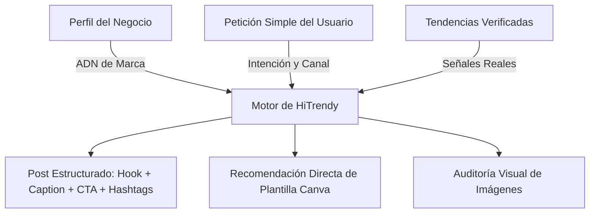

# 🎙️ HiTrendy — Dossier de Prensa y Guía de Exposición

> **Documento Oficial de Preparación para Rueda de Prensa y Medios**  
> *Fecha de presentación:* 9 de Septiembre, 2026  
> *Vocero / Presentador:* Fundador & Equipo de Desarrollo de HiTrendy  
> *Tiempo de presentación sugerido:* 5 a 7 minutos de exposición + demostración en vivo + sesión de preguntas y respuestas (Q&A).

---

## 📌 1. Ficha Técnica y Resumen Ejecutivo (Elevator Pitch)

| Parámetro | Detalle |
| :--- | :--- |
| **Nombre del Producto** | **HiTrendy** (Trend-AI) |
| **Categoría** | Asistente Web Inteligente de Marketing y Creación de Contenido |
| **Público Objetivo** | Pequeños comercios, emprendedores, creadores independientes y equipos sin departamento de marketing |
| **Propuesta Central** | Transforma el perfil y la voz de un negocio en publicaciones estratégicas, listas para usar y vinculadas a diseño visual en menos de 5 minutos. |
| **Tecnología Base** | Next.js (Frontend), FastAPI / Python 3.12 (Backend), PostgreSQL, Redis, Enrutador Multimodelo (OpenRouter / LLMs locales) |
| **Estado Actual** | Versión Beta / Producto Mínimo Viable (MVP) funcional y probado de punta a punta |

### ⚡ El "Pitch" en 30 Segundos (Lo que debes decir al abrir)
> *"Más del 90% de los negocios en nuestra región son pequeñas empresas. Saben exactamente cómo hacer su producto y atender a sus clientes, pero sufren todos los días por la falta de tiempo, conocimiento o presupuesto para hacer marketing en redes sociales.  
> **HiTrendy** no es otro chatbot genérico que responde con párrafos eternos: es un copiloto que aprende el ADN de tu negocio (tu público, tus colores, tus canales y tu tono de voz) y te entrega publicaciones estructuradas con ganchos, textos persuasivos, sugerencias de diseño en Canva y análisis de tendencias reales en cuestión de segundos."*

---

## 🚨 2. El Problema Real que Resuelve (El Contexto)

Para que los medios entiendan el valor, primero deben sentir el dolor del usuario:

1. **La brecha de las PYMES:** Un dueño de restaurante, una tienda de ropa o un profesional independiente no puede pagar los $500–$1,500 dólares mensuales que cuesta una agencia de marketing digital, ni tiene 4 horas diarias para diseñar posts.
2. **El fracaso de los chatbots tradicionales (ChatGPT / Claude convencionales):**
   - **No tienen memoria de negocio:** En cada sesión hay que volver a explicarles qué vendes, a quién le hablas y en qué ciudad estás.
   - **Requieren 'Prompt Engineering':** El usuario común no sabe redactar instrucciones técnicas extensas para obtener un buen resultado.
   - **Respuestas no formateadas:** Entregan ensayos largos de texto que nadie lee en redes sociales.
3. **El problema de las herramientas de diseño (Canva):**
   - Te dan miles de plantillas vacías, pero no te dicen **qué escribir**, **qué gancho usar para vender** ni **cuál es la estrategia comercial adecuada**.

**HiTrendy es el puente que une la estrategia de negocio, la inteligencia artificial y el diseño visual.**

---

## 💡 3. Pilares de Innovación: ¿Por qué HiTrendy es Diferente?



### 1. Memoria Activa del Negocio (ADN de Marca Persistente)
HiTrendy nunca olvida. Una vez completado un cuestionario de un minuto (*Onboarding*), la plataforma asocia cada solicitud a:
- Público objetivo (ej. jóvenes universitarios, madres de familia, ejecutivos).
- Tono de comunicación (amigable, sofisticado, juvenil, formal).
- Ubicación geográfica y canales prioritarios (Instagram, TikTok, Facebook).
- Paleta de color y estilo visual.

### 2. Contenido Estructurado, No Párrafos Genéricos
No arroja bloques interminables de texto. Cada propuesta viene desglosada en componentes comerciales probados:
- **Gancho inicial (Hook):** Frase de alto impacto para detener el scroll.
- **Cuerpo del texto (Caption):** Redacción persuasiva y empática.
- **Llamada a la Acción (CTA):** Instrucción clara para comprar o interactuar.
- **Hashtags relevantes:** Optimizados según el sector y la región.
- **Dirección de Arte:** Sugerencia visual concreta de qué imagen o video usar.

### 3. Iteración Instantánea con 1 Clic
Sin tener que reescribir prompts, el usuario puede pedir variaciones directas mediante botones inteligentes:
- `Más juvenil`
- `Más corto`
- `Más profesional`
- Cada variación se guarda vinculada a la anterior sin sobrescribir el trabajo previo.

### 4. Integración Directa con Canva y Plantillas
No deja al usuario a mitad de camino. La plataforma conecta el copy generado con plantillas recomendadas en Canva para que el usuario pueda abrir el diseño en un clic y finalizarlo.

### 5. Auditoría y Feedback Visual con IA
El usuario puede arrastrar una fotografía, volante o diseño preliminar, y la IA evalúa:
- Legibilidad tipográfica.
- Contraste y paleta de colores.
- Jerarquía visual y sugerencias concretas de mejora.

### 6. Radar de Tendencias Verificadas (Cero Alucinaciones)
A diferencia de otras IAs que "inventan" lo que es tendencia, el módulo de tendencias de HiTrendy recopila señales y evidencias comprobables con fecha, enlace de origen y nivel de relevancia calculado para el tipo de negocio.

---

## 🗺️ 4. Recorrido por el Producto: Cómo Funciona en la Práctica

Si un periodista te pide explicar las pantallas de la plataforma, este es el mapa claro:

### 1. Portada y Onboarding (`/onboarding`)
- **Tiempo de configuración:** Menos de 60 segundos.
- **Qué registra:** Nombre comercial, sector/categoría, ubicación, producto estrella, canales de publicación y personalidad de marca.
- **Resultado:** Se genera la identidad del negocio de forma automática y atómica.

### 2. Studio Creativo (`/studio`)
- **Espacio de trabajo principal:** Una interfaz limpia y moderna que combina chat inteligente con botones de acción rápida:
  - *“Crear publicación para redes”*
  - *“Auditar diseño y sugerir Canva”*
  - *“Planear contenido de la semana”*
- **Soporte multimedia:** Permite pegar imágenes del portapapeles (`Ctrl+V`) o arrastrar archivos para analizarlos al instante.

### 3. Tarjeta de Propuesta Generada
- Muestra el post estructurado listo para copiar.
- Permite guardar directamente en la carpeta de proyectos del negocio.
- Ofrece botones de tono para afinar el estilo en tiempo real.

### 4. Dashboard de Proyectos (`/dashboard`)
- Biblioteca central donde el emprendedor organiza sus campañas, borradores, publicaciones aprobadas y activos visuales para reutilizarlos en cualquier momento.

### 5. Radar de Tendencias (`/trends`)
- Panel con señales del mercado clasificadas por frescura, evidencias reales y score de afinidad con el nicho del emprendedor.

### 6. Catálogo de Plantillas (`/templates`)
- Galería curada con acceso directo a formatos verticales (Reels/TikTok), posts cuadrados de Instagram, banners y carruseles.

---

## 💻 5. Arquitectura Técnica y Privacidad (Para Prensa Tecnológica)

Si asisten periodistas de tecnología o innovación, estas son las credenciales técnicas del proyecto:

| Capa | Implementación | Ventaja Competitiva |
| :--- | :--- | :--- |
| **Frontend** | **Next.js 14+ (React) & Tailwind CSS** | Carga ultrarrápida, diseño responsivo optimizado para móviles y escritorio, componentes accesibles. |
| **Backend** | **FastAPI (Python 3.12)** | API asíncrona de alto rendimiento, validación estricta de datos mediante Pydantic y documentación OpenAPI nativa. |
| **Base de Datos & Cache** | **PostgreSQL + Redis** | Persistencia transaccional de marcas y proyectos; cache de alto rendimiento para sesiones y catálogos. |
| **Capa de IA Desacoplada** | **Enrutador Agnóstico (OpenRouter / Modelos Locales)** | No hay dependencia de un único proveedor de IA. Si un proveedor cae o sube precios, el sistema conmuta sin alterar la aplicación. |
| **Contratos Estrictos** | **Validación JSON Schema** | La IA no devuelve texto caótico; responde respetando contratos estrictos de datos, evitando alucinaciones de formato. |
| **Modo Demostración Offline** | **Adaptador Autónomo Local** | La aplicación puede ejecutarse localmente sin conexión a internet ni consumo de saldo externo para demostraciones seguras. |

### 🔒 Política de Privacidad y Ética
- **Soberanía del Negocio:** Los datos privados de los clientes no se venden ni se emplean para entrenar modelos públicos de lenguaje.
- **Control Humano Siempre:** HiTrendy no publica en redes de forma autónoma sin la revisión del dueño; es una herramienta de asistencia, no de reemplazo.

---

## 🎬 6. Guion Recomendado para la Demostración en Vivo (4 Minutos)

Para cautivar a los medios durante la rueda de prensa, sigue este guion paso a paso:

```text
[0:00 - 0:30] INTRODUCCIÓN Y CONTEXTO
Acción: Mostrar la pantalla de inicio limpia.
Palabras: "Imaginen a Laura. Ella tiene una cafetería local llamada 'Café Bambú'. 
Hace el mejor café de la ciudad, pero cuando llega el lunes no sabe qué publicar en 
redes ni cómo atraer clientes. Entra a HiTrendy..."

[0:30 - 1:15] PERFIL DEL NEGOCIO (ONBOARDING)
Acción: Mostrar el perfil activo o el paso rápido de configuración.
Palabras: "HiTrendy ya sabe que Laura vende café de especialidad, que su público son 
jóvenes y universitarios, y que su tono es fresco y amigable. Laura no tiene que 
volver a explicarlo nunca más."

[1:15 - 2:15] GENERACIÓN DE LA PUBLICACIÓN
Acción: Escribir en el Studio: "Quiero promocionar una bebida fría nueva para esta semana".
Seleccionar canal: Instagram. Hacer clic en Enviar.
Palabras: "En menos de 3 segundos, no obtenemos una parrafada genérica. Obtenemos un 
gancho de impacto, el texto persuasivo, la llamada a la acción para visitar el local, 
los hashtags locales y la sugerencia de fotografía."

[2:15 - 3:00] VARIACIÓN Y AJUSTE EN VIVO
Acción: Hacer clic en el botón "Más juvenil" o "Más corto".
Palabras: "¿No le convence el tono exacto? Con un solo clic Laura pide una versión más 
juvenil. El sistema crea una variante conectada sin borrar la original. Todo queda 
guardado en su proyecto."

[3:00 - 3:45] CONEXIÓN CON CANVA Y AUDITORÍA
Acción: Mostrar la sugerencia de plantilla de Canva lista para abrir, o arrastrar una 
imagen para ver la retroalimentación instantánea.
Palabras: "Aquí está la plantilla recomendada en Canva para este formato. Y si Laura 
ya tiene un diseño, lo sube y la IA le indica si el texto es legible y si los colores 
contrastan bien."

[3:45 - 4:15] CONCLUSIÓN
Palabras: "En cuatro minutos, Laura resolvió el marketing de su semana. HiTrendy pone 
el poder de un departamento creativo en manos de cualquier pequeño emprendedor."
```

---

## ❓ 7. Banco de Preguntas Difíciles de Periodistas (Q&A Estratégico)

Prepárate con estas respuestas contundentes ante las dudas más comunes de la prensa:

### P1: "¿Esta plataforma busca reemplazar a los diseñadores y community managers?"
> **Respuesta:**  
> *"Absolutamente no. HiTrendy está creada para el segmento que hoy está desatendido: el pequeño negocio que no tiene presupuesto para contratar una agencia y que actualmente no hace marketing o lo hace con frustración. Además, para los profesionales independientes y agencias, HiTrendy es un acelerador que elimina el trabajo repetitivo y el bloqueo creativo del inicio de semana."*

### P2: "¿Por qué un negocio usaría HiTrendy si ya existe ChatGPT de forma gratuita?"
> **Respuesta:**  
> *"Porque ChatGPT es un lienzo en blanco que no conoce tu negocio. Para que ChatGPT te dé un buen resultado, debes ser un experto escribiendo 'prompts' de 20 líneas y recordarle quién eres cada vez. HiTrendy tiene el contexto del negocio memorizado, sabe qué formatos funcionan en cada red social, te entrega respuestas estructuradas listas para usar y te conecta directamente con plantillas de diseño visual en Canva."*

### P3: "¿Qué garantías de privacidad tienen los negocios que suben sus datos?"
> **Respuesta:**  
> *"La privacidad es un pilar fundamental de nuestra arquitectura. La información del perfil, las estrategias y los archivos del negocio están aislados, protegidos y bajo control del usuario. No vendemos datos a terceros ni utilizamos la información privada de los negocios para reentrenar modelos públicos."*

### P4: "¿Publica automáticamente en las redes sociales de los clientes?"
> **Respuesta:**  
> *"En esta etapa hemos tomado la decisión consciente de mantener el principio de 'humano en el bucle' (Human-in-the-loop). El emprendedor siempre mantiene la última palabra sobre lo que sale publicado en nombre de su marca. HiTrendy prepara, optimiza y organiza el material; la aprobación y publicación final es decisión del negocio."*

### P5: "¿La plataforma funciona solo con internet o qué pasa si falla el proveedor de IA?"
> **Respuesta:**  
> *"Nuestra arquitectura es desacoplada e intercambiable. No dependemos de una sola empresa de inteligencia artificial; nuestro backend cuenta con un enrutador capaz de operar con modelos de diferentes proveedores e incluso con modelos locales. Además, disponemos de un modo de demostración autónomo para garantizar resiliencia operativa total."*

### P6: "¿Cuál es el modelo de negocio o cómo se sostendrá la plataforma?"
> **Respuesta:**  
> *"El modelo está pensado en fases: comenzamos con una Beta orientada a validar el valor real con emprendedores. La versión comercial contará con un modelo freemium accesible con cuotas de uso pensadas para el bolsillo de la microempresa, y planes avanzados para quienes requieran mayor volumen de proyectos, múltiples marcas o análisis de tendencias avanzadas."*

---

## 📢 8. Frases de Impacto para Titulares de Prensa (Soundbites)

Úsalas para tus conclusiones o para que los periodistas las citen textualmente:

1. *"HiTrendy no es un chatbot que habla mucho; es una herramienta que entrega contenido listo para vender."*
2. *"Democratizamos la inteligencia artificial para que una pequeña cafetería o tienda de barrio tenga el mismo poder comunicativo que una gran marca."*
3. *"El emprendedor conoce su producto mejor que nadie; HiTrendy le da la voz estratégica para contarlo al mundo."*
4. *"Pasar de la pantalla en blanco a un post listo con diseño en menos de cinco minutos: esa es la promesa de HiTrendy."*

---

## ✅ 9. Checklist de Preparación para el Día de la Rueda de Prensa

- [ ] **Ambiente de Demo Listo:** Verificar que el backend (`uvicorn`) y el frontend (`npm run dev`) estén corriendo en la laptop.
- [ ] **Perfil Demo Precargado:** Tener listo un negocio de ejemplo (ej. cafetería local o marca de ropa) para no perder tiempo escribiendo desde cero si el tiempo apremia.
- [ ] **Pestañas del Navegador Preparadas:**
  - Pestaña 1: Portada / Studio (`http://localhost:3000`).
  - Pestaña 2: Tendencias (`http://localhost:3000/trends`).
  - Pestaña 3: Plantillas (`http://localhost:3000/templates`).
  - Pestaña 4: Documentación / Healthcheck técnico para responder a dudas técnicas.
- [ ] **Conexión de Respaldo:** Tener habilitado el anclaje de red (hotspot) en el teléfono móvil por si la red WiFi del evento presenta lentitud.
- [ ] **Copia del Dossier a Mano:** Llevar este documento impreso o visible en una tablet para consultar datos o cifras durante la sesión de preguntas.
