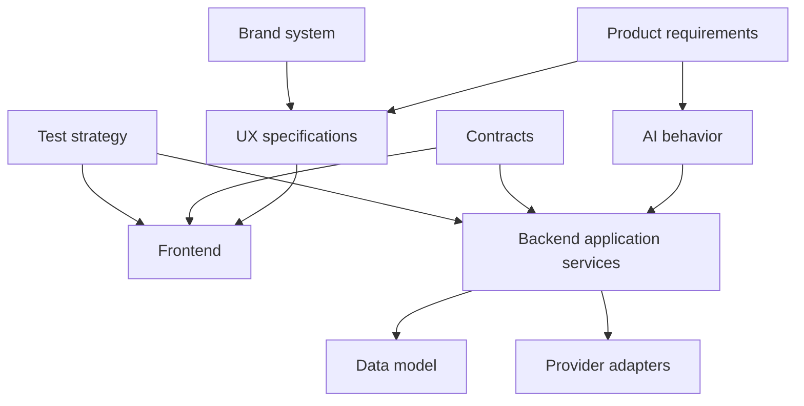

# Documentation index

This index is the human and agent entry point.

## Product

- [Vision and scope](00-product/vision-and-scope.md)
- [User flows](00-product/user-flows.md)
- [MVP demo narrative](00-product/mvp-demo-narrative.md)
- [Roadmap](00-product/roadmap.md)

## Brand

- [Brand system](01-brand/brand-system.md)
- [Design tokens](01-brand/design-tokens.md)
- [Voice and content style](01-brand/content-voice.md)
- [Accessibility](01-brand/accessibility.md)

## UX

- [Figma audit](02-ux/figma-audit.md)
- [Information architecture](02-ux/information-architecture.md)
- [Screen specifications](02-ux/screen-specs.md)
- [Component contracts](02-ux/component-contracts.md)
- [States and interface copy](02-ux/states-and-copy.md)

## Architecture

- [System context](03-architecture/system-context.md)
- [Backend architecture](03-architecture/backend.md)
- [Frontend architecture](03-architecture/frontend.md)
- [Data model](03-architecture/data-model.md)
- [Security and privacy](03-architecture/security-and-privacy.md)
- [ADRs](03-architecture/adr/)

## AI

- [AI product behavior](04-ai/ai-product-behavior.md)
- [Orchestration](04-ai/orchestration.md)
- [Skills catalog](04-ai/skills-catalog.md)
- [Prompt contracts](04-ai/prompt-contracts.md)
- [Evaluation](04-ai/evaluation.md)

## API

- [HTTP API](05-api/http-api.md)
- [Realtime events](05-api/realtime-events.md)
- [Provider interfaces](05-api/provider-interfaces.md)

## Implementation

- [Agentic playbook](06-implementation/agentic-playbook.md)
- [Backlog](06-implementation/backlog.md)
- [Test strategy](06-implementation/test-strategy.md)
- [Deployment](06-implementation/deployment.md)
- [Frontend error resolution plan](06-implementation/error-resolution-plan.md)
- [MVP delivery plan](06-implementation/mvp-delivery-plan.md)
- [Provider keys and activation](06-implementation/provider-keys.md)
- [Integration snippets](06-implementation/snippets/README.md)
- [Graphify preparation](06-implementation/graphify-ready.md)
- [Figma implementation plan](06-implementation/figma-implementation-plan.md)
- [Frontend asset inventory](06-implementation/frontend-assets-inventory.md)

## Demo and sources

- [Demo script](07-demo/demo-script.md)
- [Acceptance criteria](07-demo/acceptance.md)
- [Official references](08-references/official-sources.md)

## Beta cerrada

- [Plan maestro de beta](09-beta/00-MASTER-PLAN.md)
- [Uso, costos y administración](09-beta/09-USAGE-COST-AND-ADMIN.md)
- [Despliegue y entornos](09-beta/10-DEPLOYMENT-ENVIRONMENTS.md)
- [Runbook de incidentes](09-beta/15-BETA-INCIDENT-RUNBOOK.md)
- [Política de privacidad](09-beta/16-PRIVACY-POLICY.md)
- [Términos de beta](09-beta/17-TERMS-OF-BETA.md)
- [Checklist de aceptación](09-beta/18-BETA-ACCEPTANCE-CHECKLIST.md)
- [Threat review](09-beta/19-BETA-THREAT-REVIEW.md)
- [Wave 14: preparación operativa](09-beta/waves/WAVE-014-beta-readiness.md)

## Dependency map

